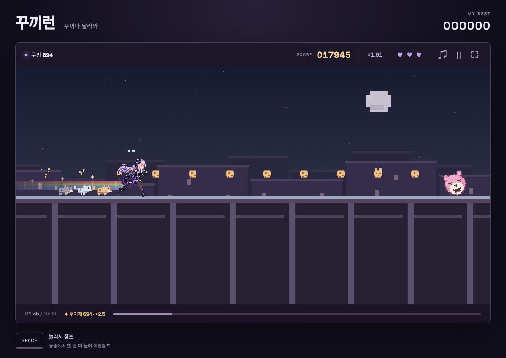

# 꾸끼런

[🎮 바로 플레이](https://koreankarp.github.io/kkuki-run/)

## 플레이 방법

쿠키를 모으며 장애물을 피해 10분 동안 달리세요. 기회는 3번입니다.

- **스페이스 / 클릭 / 터치:** 점프. 공중에서 다시 누르면 이단점프.
- **P:** 일시 정지 · 재개
- **R:** 처음부터 다시 시작
- **M:** 소리 켜기 · 끄기

피해 없이 쿠키를 30·120·300·700개 모으면 스트릭이 올라갑니다. 무지개 잔상과 동행 고양이가 추가되고, 쿠키 점수는 최대 **3배**가 됩니다. 피해를 받으면 스트릭이 초기화됩니다.
